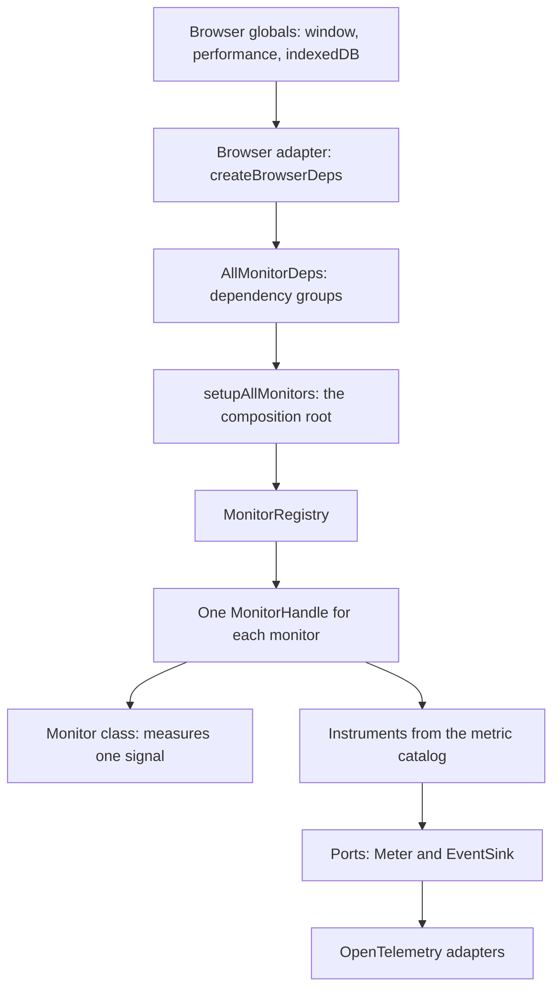
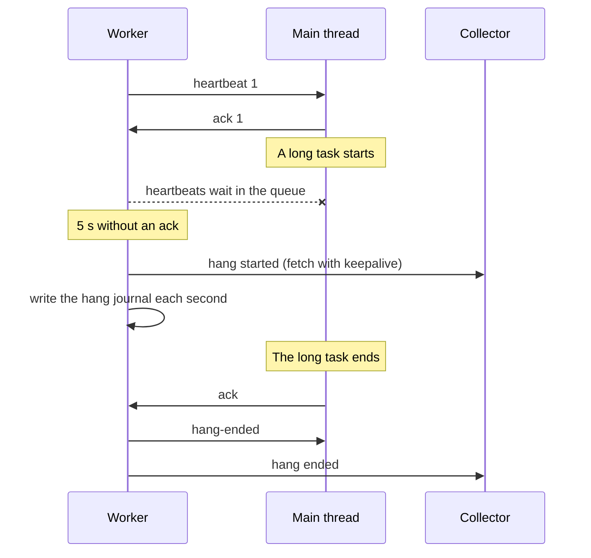
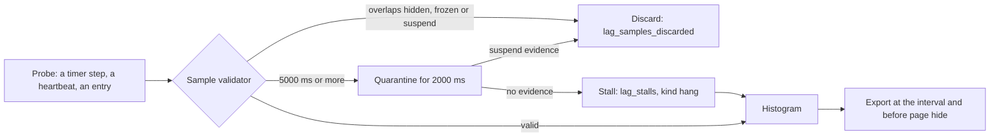

The monitors operate on the main thread of the page. They record metrics and events through ports (`Meter`, `EventSink`), and an OpenTelemetry setup exports them to the Grafana stack. Select a box on the map to read what it does.

<Figure caption="The parts of the system and how they connect. The list under the map gives the same information as text.">
  <ArchitectureMap />
</Figure>

## The layers

Only the browser adapter reads the browser globals. All other parts get their dependencies as arguments. Thus a test can give a fake clock, fake timers and a fake `PerformanceObserver`, and examine each rule with exact values.

## Inside @lag/core

| Part | Files | What it does |
|---|---|---|
| Monitors | `DriftLag.ts`, `WorkerLagMonitor.ts`, `vitals/PageViewVitals.ts` and the other monitor classes | Each class measures one signal. It gets its dependencies in its constructor and has `start()` and `stop()`. |
| Instrumented factories | `instrumented/*.ts` | One factory for each monitor. The factory makes the monitor, makes its instruments from the catalog, connects the measurement conditions, and gives a `MonitorHandle`. |
| Registry | `monitor-registry.ts` | Keeps the handles. `stopAll()` stops them in the reverse sequence of their start. |
| Composition root | `setup-all-monitors.ts` | Starts each monitor whose dependencies exist. Connects the parts that work together, for example the page-view ID for the worker. |
| Measurement conditions | `reliability.ts`, `measurement-conditions.ts` | One shared service: the intervals in which samples are not valid, and the validators that discard or classify samples. |
| Metric catalog | `metric-catalog.ts` | Every metric and event, with its name, type, unit and permitted attribute values. |
| Lifecycle | `LifecycleStateMachine.ts` | The Page Lifecycle state, with capture-phase listeners. |
| Clocks | `absolute-clock.ts`, `ClockDriftMonitor.ts`, `WorkerClockSync.ts` | The absolute clock of the page, the drift monitor, and the clock sync with the worker. |
| Browser adapter | `browser/*.ts` | `createBrowserDeps`, `createPageSource` and `createIndexedDbHangJournal`. |

### Ports and adapters

The core depends on small interfaces (ports). Adapters connect the ports to real systems.

| Port | What it gives | Adapters |
|---|---|---|
| `Meter` | Counters and histograms | An OpenTelemetry `Meter` fits it directly. `createNoopMeter()` for no output. |
| `EventSink` | Structured events | `createOtelEventSink(logger)`: OpenTelemetry log records with an event name. `withEventContext()` adds the page-view ID. |
| `Logger` | Diagnostic messages of the monitors | `createOtelLoggerAdapter()`, `createTeeLogger()` |
| `Clock`, `WallClock`, `AbsoluteClock` | `performance.now()`, `Date.now()`, and the absolute time of the context | `createAbsoluteClock(performance)` |
| `PageSource` | The navigation entry, the prerender state and the hidden times | `createPageSource(document, performance)` |
| `HangJournal` | Storage for hangs in progress | `createIndexedDbHangJournal(indexedDB)`, `createMemoryHangJournal()` |
| `WorkerLike` | The message channel to the worker | `createLagWorker()` of `@lag/worker` |
| `CrashReportContextLike` | The crash-report context of Chromium | `window.crashReport` |

## The worker

The worker bundle (`@lag/worker`) operates `createWorkerHandler()` of the core. The main thread and the worker talk with these messages:

| Direction | Message | What it does |
|---|---|---|
| Main to worker | `start` | Starts the heartbeats, with the hang options and the page ID. |
| Main to worker | `ack` | Acknowledges one heartbeat. The worker uses the acknowledgements to detect hangs. |
| Main to worker | `sync` | Asks for the time of the worker, for the clock sync. |
| Main to worker | `context` | Gives the context of the page, for example the page-view ID. |
| Main to worker | `liveness-start`, `liveness-stop` | Starts and stops the shared-memory liveness watcher. |
| Main to worker | `stop` | Stops the heartbeats. |
| Worker to main | `heartbeat` | The sequence number, the absolute send time and the lateness of the timer of the worker. |
| Worker to main | `sync-reply` | The time of the worker. |
| Worker to main | `hang-ended` | A hang ended. The main thread reads it when it can operate again. |
| Worker to main | `liveness-block` | A block that the liveness watcher saw. |

## The path of a sample

Refer to [measurement validity](/docs/concepts/measurement-validity) for the rules.

## Design rules

The design obeys the SOLID principles:

| Principle | How the library obeys it |
|---|---|
| Single responsibility | A monitor measures. A factory connects. The registry stops. The adapter reads the browser. The catalog names. |
| Open for extension | A new monitor is a new class, a new factory, new catalog entries and one line in `setupAllMonitors()`. No other part changes. |
| Substitution | Each handle has the same `MonitorHandle` shape. The registry stops each handle in the same way. |
| Interface segregation | Each factory asks only for the dependency groups that it uses (`dep-groups.ts`), for example `CoreDeps & ObserverDeps`. |
| Dependency inversion | The monitors depend on ports (duck types), not on the DOM or on OpenTelemetry. |

More rules:

- **No globals in the core.** Only `createBrowserDeps` reads `window`.
- **Error boundaries.** A factory that fails gives a handle with no monitor, and the other monitors continue. A listener or a report function that throws does not stop the monitor.
- **Full teardown.** `stop()` releases each timer, listener, observer and worker loop. The tests make sure that no timer or listener stays.
- **One source for names.** Metric names, units and attribute values come only from the catalog.

## How to add a monitor

1. Write the monitor class in `packages/lag/src`. Give it its dependencies in the constructor.
2. Add its metrics and events to `metric-catalog.ts`.
3. Write its factory in `packages/lag/src/instrumented`. Make the instruments with `createHistogram` and `createCounter` from the catalog.
4. Add one line to `setupAllMonitors()`, behind the check of its dependencies.
5. Write the unit tests, and add the metrics to the activity of `setup-all-monitors.test.ts`. The catalog test then makes sure that the metrics agree with the catalog.
6. Write its reference page in `packages/site/content/docs/monitors`.
